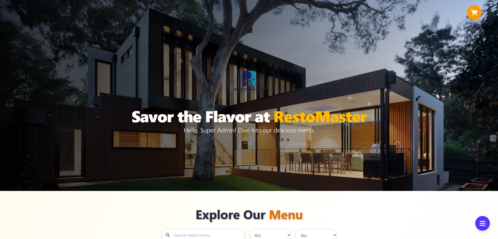
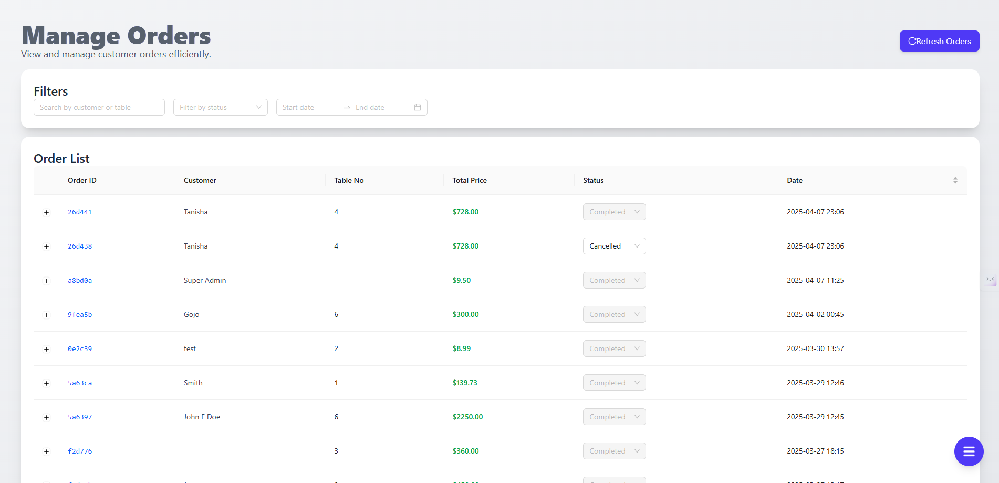
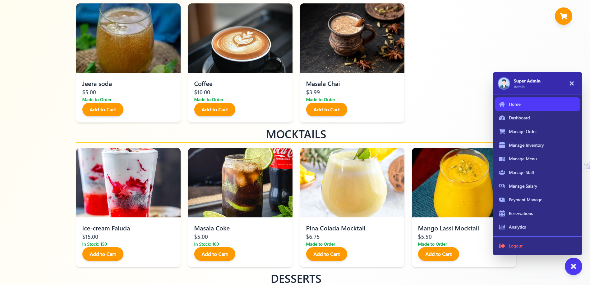
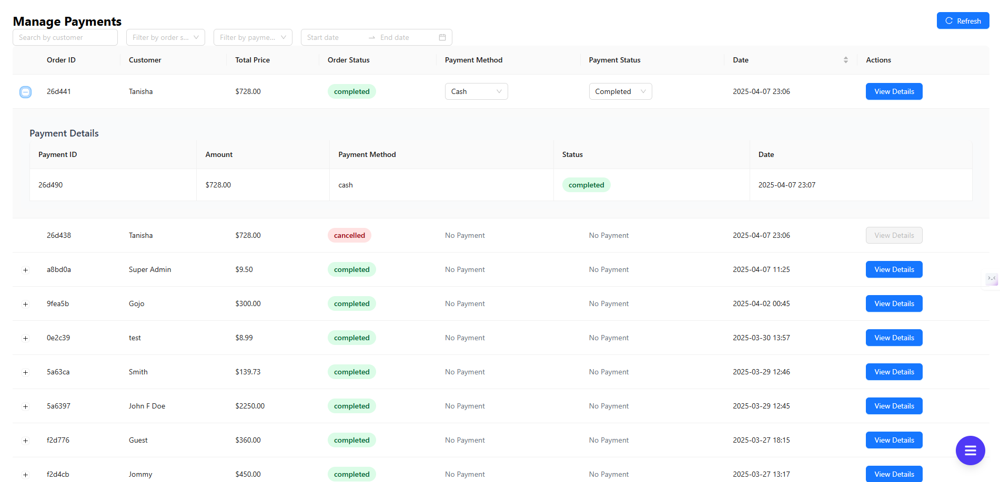

---

# 🍽️ RestoMaster - Restaurant Management System

Welcome to **RestoMaster**, a comprehensive web-based Restaurant Management System designed with the powerful **MERN stack**. It simplifies restaurant operations including order tracking, inventory management, menu customization, and staff supervision.

With modern UI frameworks like **Tailwind CSS**, **Ant Design**, and animations from **Framer Motion**, the interface is both elegant and responsive—ideal for any device.

---

## 🚀 Live Demo

🌐 **RestoMaster**: [Live Link](https://restomasterfrontend.vercel.app/)  

---

## ✨ Features

- 🔐 **User Authentication**  
  Secure login system with role-based,permission-based access control (Admin, Staff)

- 🧾 **Order Management**  
  Real-time creation, updating, and tracking of customer orders

- 🧑‍🍳 **Menu Management**  
  Dynamic menu with categories, pricing, and add-ons

- 📦 **Inventory Tracking**  
  Monitor stock, receive low-stock alerts, and update quantities

- 👥 **Staff Management**  
  Manage user roles, employee schedules, and performance

- 📊 **Analytics Dashboard**  
  Sales charts, order history, performance summaries

- 📱 **Responsive UI**  
  Optimized for desktop, tablet, and mobile experiences

- 🌀 **Smooth Animations**  
  Framer Motion-driven transitions and UI animations

- ⚡ **Real-Time Updates**  
  MongoDB integration for seamless data updates

---

## 🧑‍💻 Tech Stack

### Frontend
- [React.js](https://reactjs.org/)
- [Redux](https://redux.js.org/)
- [Tailwind CSS](https://tailwindcss.com/)
- [Ant Design](https://ant.design/)
- [Framer Motion](https://www.framer.com/motion/)
- [Axios](https://axios-http.com/)

### Backend
- [Node.js](https://nodejs.org/)
- [Express.js](https://expressjs.com/)
- [MongoDB](https://www.mongodb.com/)
- [JWT](https://jwt.io/)
- [Bcrypt](https://github.com/kelektiv/node.bcrypt.js)

### Dev Tools
- Git, Vercel (Frontend hosting), Render (Backend hosting), Postman (API testing)

---

## 📁 Folder Structure

```
RestoMaster/
│
├── Backend/
|   ├── comfig
|   |     └──.env
│   ├── controllers/
│   ├── middleware/
│   ├── models/
│   ├── routes/
│   ├── utils/
│   ├── server.js
│   └── seed.js
│
├── Frontend/
│   ├── public/
│   └── src/
│       ├── assets/
│       ├── components/
│       │   ├── Auth/
│       │   ├── Layout/
│       │   ├── Loading/
│       │   ├── Pages/
│       │   ├── Redux/
│       │   └── Storage/
│       ├── ProtectedRoute.jsx
│       ├── App.jsx
│       └── index.css
│
└── .env
```

---

## 🛠️ Installation & Setup

### 1. Clone the Repository
```bash
git clone https://github.com/PavilionRYZ/RMS-IN.git
cd RMS-IN
```

### 2. Setup Backend

```bash
cd Backend
npm install
```

Create a `.env` file in the `Backend` directory with the following:
```env
PORT=5000
MONGO_URI=your_mongodb_connection_string
JWT_SECRET=your_jwt_secret

EMAIL_USER=your_email
EMAIL_PASSWORD=get_it_from_browser

SMTP_HOST=your_email_host
SMTP_PORT=your_email_port

```

To run the backend server:
```bash
npm run dev
```

### 3. Setup Frontend

```bash
cd ../Frontend
npm install
```
Create a `.env` file in the `Frontend` directory with the following:
```env
VITE_FRONTEND_API_GOOGLE_AUTHENTICATE=firebase_api
VITE_API_URL=your_backend_url

```

To run the frontend:
```bash
npm run dev
```

---

## 🌱 Seed Data (Optional)

To populate the database with initial values:

```bash
node seed.js
```

---

## 📷 Preview

> 
> 
> 
> 
> 
---

## 📌 Future Enhancements

- PDF invoice generation
- QR code table ordering
- Firebase notifications for order updates
- Multi-language support
- Admin reports export

---

## 🤝 Contributing

Feel free to fork this repo, raise issues, or suggest improvements. Contributions are always welcome!

---

## 📄 License

This project is licensed under the **MIT License**.

---